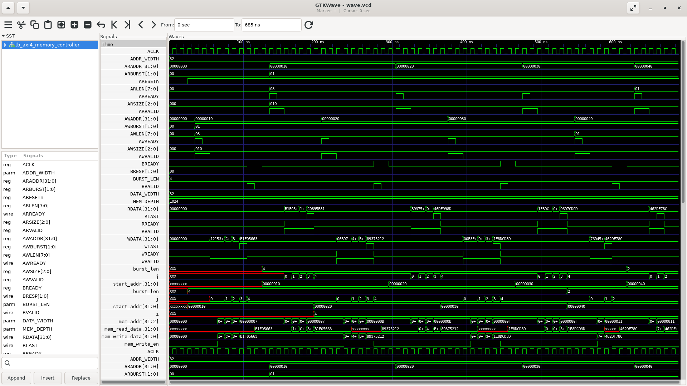

# AXI4_Memory_Controller

AXI4-Lite compatible memory controller with Verilog testbench and simulation.

AXI4 (Advanced eXtensible Interface 4) is part of the AMBA protocol family developed by ARM. It’s a high-performance, high-frequency bus used in SoC (System on Chip) designs. It defines how different components (like CPUs, memory controllers, and peripherals) communicate.

---
## Key features
-  **Burst Transfers** — Multi-beat transfers (up to 256 beats supported)

-  **Pipelined Channels** — Independent read/write channels for high throughput

-  **Scalable Interface** — Modular Verilog design ideal for SoC integration

-  **Synthesizable RTL** — Fully compatible with synthesis tools

-  **Testbench Included** — Verilog testbench with simulation waveforms

----
###

## AXI4 Channel Overview ;

| Prefix	| Channel	| Purpose| 
|----------|---------|----------| 
| AW	    | Write Address| Address & control for write.| 
| W | 	Write Data| 	Actual write data.| 
| B	| Write Response | 	Write status / response.| 
| AR	| Read Address	| Address & control for read.| 
| R	| Read Data	| Actual read data & response.| 
### AXI Write Address Channel ;

| Port Name | Direction | Width       | Purpose                  |
| --------- | --------- | ----------- | ---------------------------- |
| ACLK      | Input     |   -       | Global clock                 |
| ARESETn   | Input     |   -       | Active-low synchronous reset.|
| AWADDR    | Input     | ADDR_WIDTH | Write address for the first data in a burst. |
| AWLEN   | Input     | 8 bits | Burst length (number of data transfers minus one). |
| AWSIZE   | Input     | 3 bits | Size of each data transfer in the burst (encoded, typically power-of-two bytes). |
| AWBURST  | Input     | 2 bits | Burst type (e.g., INCR, FIXED, WRAP). |
| AWVALID   | Input     | 1 bit       | Master signals when address/control info is valid. |
| AWREADY   | Output    | 1 bit       | Slave signals ready to accept address/control info.  |

### AXI Write Data Channel ;

| Port Name|	Direction	|Width|	Purpose|
|----------|-----------|-----|--------|
|WDATA	|Input|	DATA_WIDTH	|The actual data to be written; size is set by the bus/data width parameter.|
|WVALID |	Input |	1 bit	|Asserted by the master; indicates that WDATA contains valid data.|
|WLAST	|Input |	1 bit |	Asserted by the master on the final transfer (last 'beat') of a burst signals the end of the write burst.|
|WREADY	 |Output	| 1 bit |	Asserted by the slave; indicates it is ready to accept data on the current cycle.|

### AXI Write Response Channel ;

| Port Name	| Direction| 	Width| Purpose| 
| --------| ----| ------| -------| 
|BRESP	|Output	|2 bit	|Write response (OKAY, SLVERR, etc).|
|BVALID	|Output	|1 bit	|Slave: Write response is ready.|
|BREADY	|Input	|1 bit	|Master: Ready to accept (take) a write response.|

### AXI Read Address Channel ;

| Port Name	| Direction| 	Width| Purpose| 
| --------| ----| ------| -------| 
|ARADDR |Input	|ADDR_WIDTH	 |The slave address to be read from. Master sets this to the first address of the burst.|
|ARLEN | Input | 8 bit |Number of data transfers (beats) in this burst, minus one. (So, ARLEN=3 means 4 transfers.).|
|ARSIZE 	|Input | 3 bit| Number of bytes per data transfer in the burst. Example:3'b010= 4 bytes (32 bits).|
|ARBURST  |Input |	2 bit	|Burst type (2’b00 = FIXED, 2’b01 = INCR, 2’b10 = WRAP).|
|ARVALID |	Input | 1 bit	|Indicates master has placed a valid read address and burst info on the bus.|
|ARREADY	|Output | 1 bit  	|Indicates slave is ready to accept the read address and burst info from the master.|

### AXI Read Data Channel ;

| Port Name	| Direction| 	Width| Purpose| 
| --------| ----| ------| -------| 
|RDATA	|Output|	DATA_WIDTH |	The actual data word(s) read from the slave memory and returned to master.|
|RVALID|	Output|	1 bit |	Indicates to the master that the value on RDATA is valid and can be accepted.|
|RLAST	|Output	|1 bit	|Indicates the last data word of a burst read. Set high for only the last transfer.|
|RREADY|	Input	|1 bit|	Indicates the master is ready to accept read data. The slave only drives RDATA when both RVALID and RREADY are high.|

-----

## Tools And Simulation;

| Tool                | Purpose                        | Notes                                    |
| ------------------- | ------------------------------ | ---------------------------------------- |
| **Icarus Verilog**  | RTL simulation and compilation | `iverilog` to compile and `vvp` to run   |
| **GTKWave**         | Waveform viewing               | Displays `VCD` (Value Change Dump) files |
| **GHDL (optional)** | Alternate VHDL simulation      | If you use mixed-language simulation     |

  Step 1: Compile Verilog files
  
     iverilog -o sim.vvp rtl/*.v tb/*.v

 Step 2: Run simulation
 
     vvp sim.vvp

  Step 3: View waveforms
  
    gtkwave dump.vcd
-----
 ## Make sure your testbench includes ;

verilog test_bench

      $dumpfile("dump.vcd");
      $dumpvars(0, tb_axi_memory_controller);
------
## Result ;

### Simulation result 

 This project is open-source and provided under the MIT License. Contributions are welcome!

